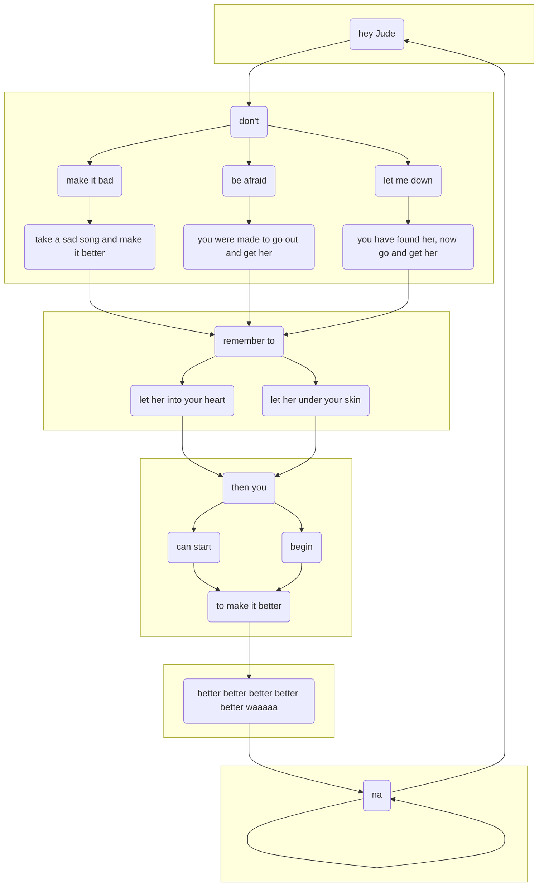

# mermaidian-hey-jude

```mermaid
flowchart TD
    subgraph one [ ]
        hj(hey Jude)
    end 

    subgraph two [ ]
        direction LR
        d(don't) --> mib(make it bad) & ba(be afraid) & lmd(let me down)
        mib --> tas(take a sad song and make it better)
        ba --> ywm(you were made to go out and get her)
        lmd --> yhf(you have found her, now go and get her)
    end
    hj --> d

    subgraph three [ ]
        direction LR
        rt(remember to) --> lhi(let her into your heart) & lhu(let her under your skin)
    end
    tas & ywm & yhf --> rt

    subgraph four [ ]
        direction LR
        ty(then you) --> cs(can start) & b(begin)
        cs & b --> tmi(to make it better)
    end
    lhi & lhu --> ty

    subgraph five [ ]
        direction LR
        bbb(better better better better better waaaaa)
    end
    tmi --> bbb

    subgraph six [ ]
        direction LR
        na(na)
    end
    bbb --> na

    na --> na
    na -----> hj
```
