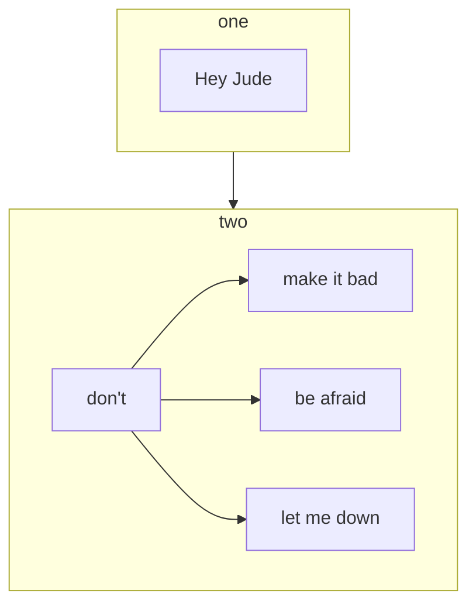

# mermaidian-hey-jude

```mermaid
flowchart TD
    subgraph one
        HJ[Hey Jude]
    end
    subgraph two
        direction LR
        don't --> MIB[make it bad] & BA[be afraid] & LMD[let me down]
    end
    one --> two
```
